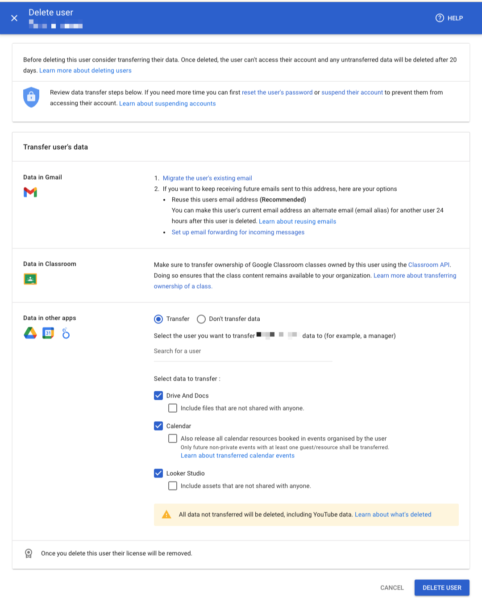

# Google Admin Console - Delete User UX Copy

## Table of contents <!-- omit in toc -->

* [Title](#title)
* [Banner 1](#banner-1)
* [Banner 2](#banner-2)
* [Transfer user's data](#transfer-users-data)
  * [Data in Gmail](#data-in-gmail)
  * [Data in Classroom](#data-in-classroom)
  * [Data in other apps](#data-in-other-apps)
* [Footer banner](#footer-banner)
* [Footer](#footer)
* [CTA buttons](#cta-buttons)
* [Screenshot](#screenshot)

## Title

Delete user {{user_full_name}}

## Banner 1

Before deleting this user consider transferring their data. Once deleted, the user can't access their account and any untransferred data will be deleted after 20 days. [Learn more about deleting users](https://support.google.com/a/answer/33314?hl=en)

## Banner 2

Review data transfer steps below. If you need more time you can first [reset the user's password](https://admin.google.com/ac/users/4f1mdlm24gucke/profile?action_id=RESET_PASSWORD) or [suspend their account](https://admin.google.com/ac/users/4f1mdlm24gucke/profile?action_id=SUSPEND_USER) to prevent them from accessing their account. [Learn about suspending accounts](https://support.google.com/a/answer/33312?hl=en)

## Transfer user's data

### Data in Gmail

1. [Migrate the user's existing email](https://admin.google.com/ac/migrate/gmail)
2. If you want to keep receiving future emails sent to this address, here are your options:
    * Reuse this users email address **(Recommended)**  
      You can make this user's current email address an alternate email (email alias) for another user 24 hours after this user is deleted.  
      [Learn about reusing emails](https://support.google.com/a/answer/33327?hl=en)
    * [Set up email forwarding for incoming messages](https://admin.google.com/ac/apps/gmail/defaultrouting)

### Data in Classroom

Make sure to transfer ownership of Google Classroom classes owned by this user using the [Classroom API](https://developers.google.com/classroom/guides/manage-courses#transfer_course_ownership).  
Doing so ensures that the class content remains available to your organization.  
[Learn more about transferring ownership of a class.](https://support.google.com/edu/classroom/answer/7477648?hl=en)

### Data in other apps

* Select the user you want to transfer **{{user_full_name}}'s** data to (for example, a manager)
* Select data to transfer:
  * [ ] Drive And Docs
  * [ ] Include files that are not shared with anyone.
  * [ ] Calendar
  * [ ] Also release all calendar resources booked in events organised by the user  
     Only future non-private events with at least one guest/resource shall be transferred.  
     [Learn about transferred calendar events](https://support.google.com/a/answer/7399420?hl=en#transferdelete)
  * [ ] Looker Studio
  * [ ] Include assets that are not shared with anyone.

## Footer banner

All data not transferred will be deleted, including YouTube data.  
[Learn about what's deleted](https://support.google.com/a/answer/33314?hl=en)

## Footer

Once you delete this user their license will be removed.

## CTA buttons

* [CANCEL]
* [DELETE USER]

## Screenshot

